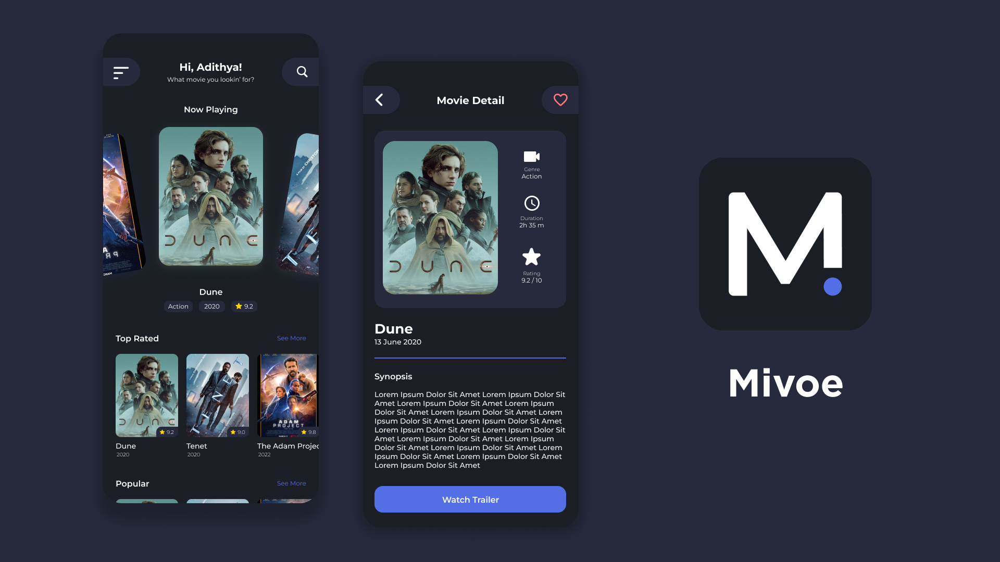
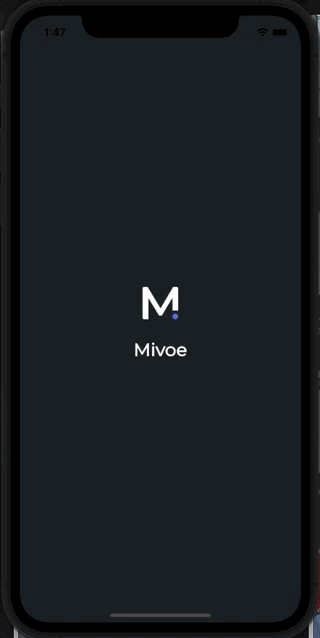
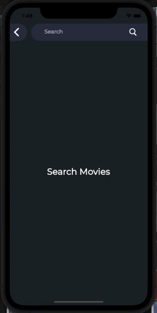

<h1 align="center">
  Mivoe
</h1>
<p align="center">
  Movie App from The Movie DB API
</p>
<p align="center">
  <a href="https://flutter.dev/"></a>
  <a href="https://dart.dev/"></a>
  <a href="https://github.com/Adithya-13/Mivoe/"></a>
</p>

<p align="center">
  
</p>

## Table of Contents
- [Introduction](#introduction)
- [Installation](#installation)
- [Demo](#demo)
- [Features](#features)
- [Tech Stack](#tech-stack)
- [Dependencies](#dependencies)

## Introduction

Mivoe is a Movie Application for the people who lookin for the new movie, popular, top rated, upcoming, and now playing movie.

In this project, I use TMDB API, for details you can see [here](#tech-stack).

The challenge here is that I created a movie app only 2 days within the integration of the API, which is very challenging for me. To see what features I made, you can see [here](#features).

I, use BloC as my State Management, and also use Get Storage to store state on local device. To see what Dependencies I created, you can see [here](#dependencies).

## Installation

Clone or Download and Open it into Android Studio, VSCode, or Other IDE / Text Editor
```
https://github.com/Adithya-13/Mivoe.git
```  

## Demo

|Splash|Dashboard|Navigation Drawer|
|--|--|--|
||||

|Search|Detail Movie|
|--|--|
|||

## Features
- Splash
- Dashboard
- Navigation Drawer
- Search
- Detail Movie

## Tech Stack
- BloC Architecture Pattern
- BloC State Management
- Clean Architecture (data, domain, presentation)

## Dependencies
- [Equatable](https://pub.dev/packages/equatable)
- [RxDart](https://pub.dev/packages/rxdart)
- [Flutter Bloc](https://pub.dev/packages/flutter_bloc)
- [Logging](https://pub.dev/packages/logging)
- [Flutter SVG](https://pub.dev/packages/flutter_svg)
- [Cached Network Image](https://pub.dev/packages/cached_network_image)
- [Auto Size Text](https://pub.dev/packages/auto_size_text)
- [Get Storage](https://pub.dev/packages/get_storage)
- [Freezed](https://pub.dev/packages/freezed)
- [Dio](https://pub.dev/packages/dio)
- [Flutter Slider Drawer](https://pub.dev/packages/flutter_slider_drawer)
- [Card Swiper](https://pub.dev/packages/card_swiper)
- [Gen Export](https://pub.dev/packages/gen_export)
- [Google Font](https://pub.dev/packages/google_font)


